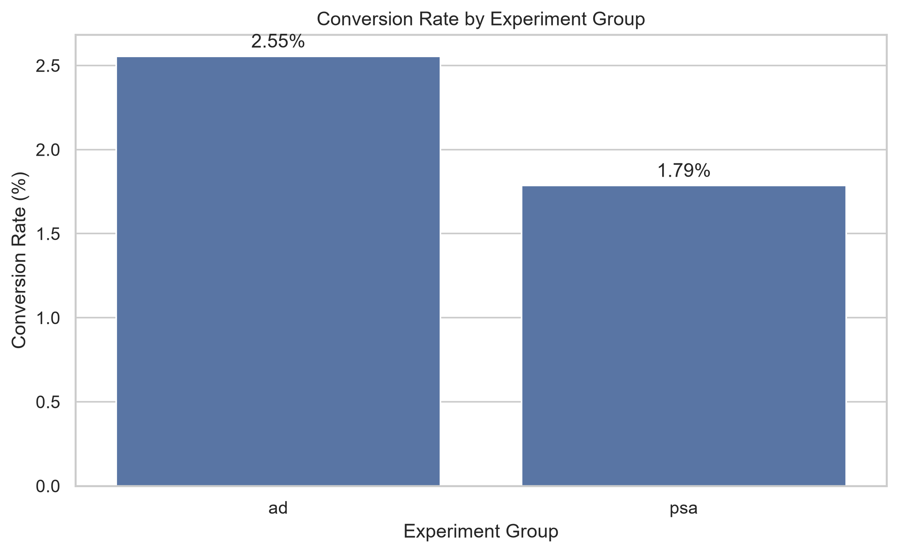
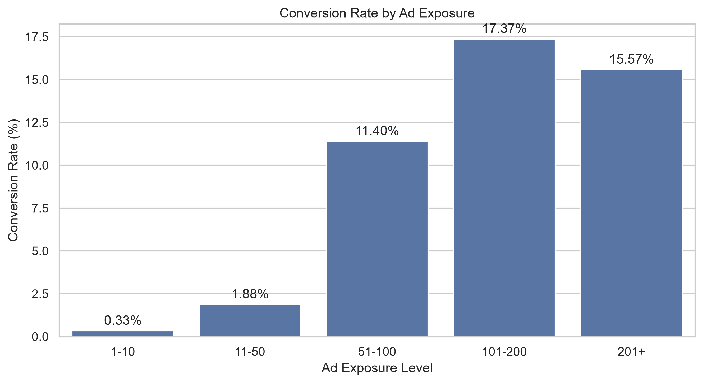
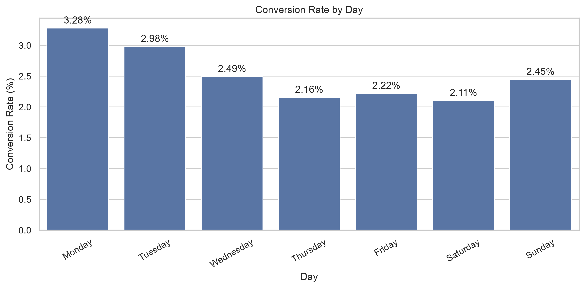
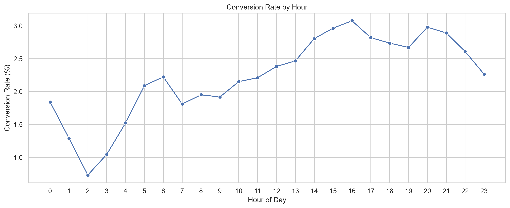

# Product Experimentation & Conversion Optimization

## A/B Testing, Statistical Significance & Marketing Performance Analysis

---

## 1. Project Overview

This project analyzes the performance of two marketing strategies — an **Ad campaign** and a **PSA control campaign** — using A/B testing and statistical analysis.

The objective is to determine whether the Ad campaign generates a significantly higher conversion rate than the PSA group and identify additional patterns related to ad exposure, campaign timing, and conversion behavior.

The analysis combines **Python, Pandas, exploratory data analysis, statistical hypothesis testing, data visualization, and business recommendations** to simulate a real-world product and marketing experimentation workflow.

---

## 2. Business Problem

A marketing team is running an experiment to compare two campaign strategies:

- **Ad group** — users exposed to the advertising campaign
- **PSA group** — users exposed to the public service announcement/control campaign

The business needs to determine:

- Which campaign produces better conversion performance?
- Is the observed difference statistically significant?
- How does conversion vary with ad exposure?
- Which days and hours show stronger conversion performance?
- What actions should the marketing team take based on the findings?

---

## 3. Project Objectives

- Compare conversion rates between the Ad and PSA groups.
- Measure absolute conversion-rate difference.
- Calculate relative conversion lift.
- Perform a two-proportion Z-test.
- Determine statistical significance using a 5% significance level.
- Calculate a 95% confidence interval.
- Analyze conversion patterns by ad exposure.
- Analyze conversion patterns by day and hour.
- Translate analytical findings into actionable business recommendations.

## 4. Dataset

---

The dataset contains user-level marketing experiment information, including:

- User ID
- Experiment group
- Conversion status
- Total ad exposure
- Most frequent ad exposure day
- Most frequent ad exposure hour

### Dataset Groups

| Group | Description |
|---|---|
| Ad | Users exposed to the advertising campaign |
| PSA | Control group exposed to the PSA campaign |

The cleaned dataset used for visualization and analysis contains approximately **588K user records**.

---

## 5. Tools & Technologies

| Tool / Technology | Purpose |
|---|---|
| Python | Data analysis and statistical analysis |
| Pandas | Data manipulation and aggregation |
| NumPy | Numerical calculations |
| Matplotlib | Data visualization |
| Seaborn | Statistical visualization |
| SciPy | Statistical testing |
| Jupyter Notebook | Analysis workflow and documentation |
| Git / GitHub | Version control and portfolio presentation |

---

## 6. Project Workflow

```text
Raw Dataset
    ↓
Data Inspection
    ↓
Data Quality Validation
    ↓
Data Cleaning
    ↓
Exploratory Data Analysis
    ↓
A/B Test Analysis
    ↓
Statistical Significance Testing
    ↓
Visualization
    ↓
Business Recommendations
    ↓
Final Business Conclusion
```

---

## 7. Key Metrics

### 7.1 Conversion Rate

Conversion rate measures the percentage of users who completed the desired conversion.

```text
Conversion Rate = Conversions / Users × 100
```

### 7.2 Absolute Conversion Difference

The absolute difference measures the percentage-point difference between the Ad and PSA groups.

```text
Absolute Difference = Ad Conversion Rate − PSA Conversion Rate
```

### 7.3 Relative Conversion Lift

Relative conversion lift measures how much higher the Ad group's conversion rate is compared with the PSA group.

```text
Relative Lift = (Ad Conversion Rate − PSA Conversion Rate) ÷ PSA Conversion Rate × 100
```

### 7.4 Statistical Significance

A two-proportion Z-test was used to determine whether the difference in conversion rates between the Ad and PSA groups is statistically significant.

**Significance level:** `α = 0.05`

---

## 8. A/B Test Results

### 8.1 Experiment Group Performance

| Metric | Ad | PSA |
|---|---:|---:|
| Users | 564,577 | 23,524 |
| Conversions | 14,423 | 420 |
| Conversion Rate | 2.55% | 1.79% |

The Ad group achieved a higher conversion rate than the PSA control group.

### 8.2 Conversion Rate Comparison

- **Ad conversion rate:** 2.55%
- **PSA conversion rate:** 1.79%
- **Absolute difference:** 0.7692 percentage points
- **Relative conversion lift:** 43.09%

The Ad campaign achieved approximately **43.09% higher relative conversion performance** compared with the PSA group.

### 8.3 Statistical Significance

A two-proportion Z-test was performed to determine whether the difference between the Ad and PSA conversion rates was statistically significant.

| Statistical Metric | Result |
|---|---:|
| Z-statistic | 7.3701 |
| P-value | < 0.001 |
| Significance Level | 0.05 |
| Decision | Reject H₀ |
| Result | Statistically Significant |

### Hypotheses

**H₀:** There is no difference in conversion rates between the Ad and PSA groups.

**H₁:** There is a difference in conversion rates between the Ad and PSA groups.

Since:

`p-value < α`

the null hypothesis is rejected.

Therefore, the difference in conversion rates between the Ad and PSA groups is **statistically significant**.

### 8.4 Confidence Interval

The 95% confidence interval for the conversion-rate difference is:

`[0.5951%, 0.9434%]`

The confidence interval does not include zero, providing additional evidence that the conversion rates of the two experiment groups are significantly different.

### 8.5 Statistical Conclusion

The statistical analysis provides strong evidence that the Ad group achieved a higher conversion rate than the PSA group.

---

## 9. Exploratory Findings

### 9.1 Conversion Rate by Ad Exposure

Conversion rates increased substantially across higher observed ad-exposure levels.

The **101–200 ads** exposure range recorded the highest observed conversion rate at approximately **17.37%**.

However, this relationship is observational and should not automatically be interpreted as evidence that increasing ad exposure causes higher conversion.

### 9.2 Conversion Rate by Day

Conversion performance varied across the days of the week.

- **Monday:** 3.28%
- **Tuesday:** 2.98%
- **Wednesday:** 2.49%
- **Thursday:** 2.16%
- **Friday:** 2.22%
- **Saturday:** 2.11%
- **Sunday:** 2.45%

Monday recorded the highest observed daily conversion rate at approximately **3.28%**.

### 9.3 Conversion Rate by Hour

Conversion performance also varied across the hours of the day.

The highest observed hourly conversion rate occurred at **16:00**, at approximately **3.08%**.

This indicates that campaign timing may be an important area for further controlled experimentation.

---

## 10. Visualizations

The analysis produced five key visualizations covering experiment performance, ad exposure, timing, and A/B test results.

### 10.1 Conversion Rate by Experiment Group



This visualization compares conversion performance between the Ad and PSA groups.

### 10.2 Conversion Rate by Ad Exposure



This visualization shows the relationship between observed ad exposure levels and conversion rates.

### 10.3 Conversion Rate by Day



This visualization compares conversion performance across the days of the week.

### 10.4 Conversion Rate by Hour



This visualization shows how conversion rates vary throughout the day.

### 10.5 A/B Test Conversion Comparison


This visualization summarizes the conversion-rate difference between the Ad and PSA experiment groups.

---

## 11. Business Recommendations

### 11.1 Prioritize the Ad Campaign

The Ad campaign demonstrated significantly stronger conversion performance than the PSA campaign.

**Action:**

- Prioritize the Ad strategy for future acquisition experiments.
- Continue controlled testing before unrestricted scaling.

### 11.2 Optimize Ad Timing

Conversion performance varies across days and hours.

**Action:**

- Test campaign activity during high-performing periods.
- Investigate Monday and the 16:00 period through controlled experiments.
- Evaluate whether optimized timing improves campaign efficiency.

### 11.3 Optimize Ad Exposure

Higher ad exposure was associated with higher observed conversion rates.

**Action:**

- Investigate the 101–200 exposure range.
- Test different exposure levels experimentally.
- Monitor conversion together with engagement and campaign cost.

### 11.4 Test New Ad Creatives

The results provide an opportunity to further optimize the advertising strategy.

**Action:**

- Test different creative formats.
- Experiment with messaging and calls to action.
- Compare variations through controlled A/B testing.

### 11.5 Continue A/B Testing

Future campaign changes should be validated through experimentation.

**Action:**

- Test targeting strategies, creatives, messaging, and exposure levels.
- Track conversion rate, conversion lift, and statistical significance.
- Validate results across different customer segments and periods.

### 11.6 Monitor Campaign Cost

Higher conversion does not automatically mean higher profitability.

**Action:**

- Monitor advertising spend.
- Evaluate customer acquisition cost and revenue when available.
- Measure campaign efficiency before unrestricted scaling.

---

## 12. Business Action Plan

| Priority | Action | Expected Outcome |
|---|---|---|
| High | Prioritize Ad campaign | Improve conversion performance |
| High | Test high-performing time periods | Improve campaign efficiency |
| High | Investigate optimal ad exposure | Identify efficient exposure level |
| Medium | Test new ad creatives | Improve engagement and conversion |
| Medium | Continue A/B testing | Support data-driven decisions |
| Medium | Monitor campaign cost | Balance conversion gains with efficiency |

---

## 13. Key Business Conclusion

The analysis indicates that the **Ad campaign is the stronger-performing strategy**.

The Ad group achieved a conversion rate of **2.55%**, compared with **1.79%** for the PSA group, representing approximately **43.09% relative conversion lift**.

The two-proportion Z-test confirms that the observed difference is **statistically significant**.

Therefore, the business should **prioritize the Ad strategy while continuing controlled experimentation** to optimize campaign timing, ad exposure, creative content, and overall marketing efficiency.

---

## 14. Dataset Limitations

### 14.1 Unequal Experiment Group Sizes

The experiment contains substantially more users in the Ad group than in the PSA control group.

- **Ad group:** 564,577 users
- **PSA group:** 23,524 users

The statistical test accounts for the different sample sizes, but the substantial group imbalance should still be considered when interpreting the experiment results.

### 14.2 Limited Business Economics

The dataset provides conversion information but does not include important financial metrics such as:

- Advertising spend
- Customer acquisition cost
- Revenue per conversion
- Profit margin
- Customer lifetime value
- Return on advertising spend

Therefore, a statistically significant improvement in conversion does not automatically mean that the campaign is financially profitable.

### 14.3 Limited Customer-Level Information

The dataset does not provide detailed customer characteristics such as demographics, purchasing power, or customer lifetime value.

This limits deeper customer segmentation and makes it difficult to determine whether campaign effectiveness varies across different customer-value or demographic segments.

### 14.4 Ad Exposure and Conversion Relationship

Higher ad exposure is associated with higher observed conversion rates in the dataset.

However, this relationship should not automatically be interpreted as causal. Users receiving different levels of ad exposure may differ in ways that are not captured by the dataset.

The A/B experiment provides evidence for the difference between the assigned Ad and PSA groups, while analysis across different exposure levels is primarily observational.

Further controlled experimentation is recommended before making decisions about increasing customer ad exposure.

### 14.5 Limited Observation Period and Generalizability

The results are based on the available observation period and this particular experiment.

The findings may not generalize directly to:

- Different customer populations
- Different advertising campaigns
- Different seasons
- Different markets
- Future customer behavior

Additional experiments across different periods and customer populations would strengthen confidence in the findings.

### 14.6 Conversion as the Primary Outcome

The analysis focuses primarily on conversion.

Other important product and marketing outcomes, such as:

- Retention
- Repeat purchases
- Engagement
- Revenue
- Customer lifetime value

are not available in the dataset.

Therefore, the analysis measures campaign effectiveness primarily through conversion rather than long-term customer or financial outcomes.

### Overall Limitation

The A/B test provides strong statistical evidence that the Ad group achieved a higher conversion rate than the PSA group.

However, statistical significance alone does not determine whether the campaign should be scaled without restriction. The final business decision should also consider campaign economics, customer value, long-term outcomes, exposure efficiency, and additional controlled experimentation.

---

## 15. Skills Demonstrated

### Data Analysis

- Data cleaning
- Data validation
- Exploratory data analysis
- Group-level analysis
- Aggregation
- Conversion analysis

### Statistical Analysis

- A/B testing
- Hypothesis formulation
- Two-proportion Z-test
- P-value interpretation
- Confidence intervals
- Statistical significance
- Conversion lift analysis

### Data Visualization

- Bar charts
- Time-based analysis
- Exposure-level analysis
- Comparative visualization
- Business-focused visual storytelling

### Business Analytics

- Marketing performance analysis
- Experiment evaluation
- Campaign optimization
- Business recommendation development
- Action-plan creation
- Analytical limitation assessment

---

## 16. Conclusion

This project demonstrates an end-to-end **product experimentation and marketing analytics workflow**, from raw user-level data through statistical testing and business decision-making.

The analysis found that the **Ad group achieved a 2.55% conversion rate compared with 1.79% for the PSA control group**, representing a **43.09% relative conversion lift**.

The two-proportion Z-test produced a **Z-statistic of 7.3701** with a **p-value below 0.001**, confirming that the observed difference is statistically significant.

The analysis therefore provides strong evidence that the Ad strategy outperformed the PSA control group in conversion performance.

However, statistical significance alone does not establish campaign profitability. Further experimentation and evaluation of advertising cost, revenue, customer value, and long-term outcomes are recommended before unrestricted scaling.

**Key takeaway:**

> The Ad strategy demonstrates statistically significant stronger conversion performance, while continued experimentation and business-economic evaluation are necessary for sustainable campaign optimization.

---

## 17. Project Structure

```text
Product Experimentation & Conversion Optimization/
│
├── 01_Dataset/
│   ├── marketing_AB.csv
│   └── marketing_AB_cleaned.csv
│
├── 02_Notebooks/
│   └── product_ab_testing.ipynb
│
├── 03_Visualizations/
│   ├── 01_conversion_rate_by_group.png
│   ├── 02_conversion_rate_by_ad_exposure.png
│   ├── 03_conversion_rate_by_day.png
│   ├── 04_conversion_rate_by_hour.png
│   └── 05_ab_test_result.png
│
├── 04_Analysis/
│   ├── 01_AB_Test_Results.md
│   ├── 02_Statistical_Results.md
│   └── 03_Dataset_Limitations.md
│
├── 05_Business_Recommendations/
│   └── 01_Business_Recommendations.md
│
└── README.md
```

---

# 18. Author

**ABHIRAMI ANANTHAKUMAR**

Data Analyst | Business Intelligence | Data Analytics

- **LinkedIn:** [https://www.linkedin.com/in/abhirami-ananthakumar-8b83a5256]
- **GitHub:** [https://github.com/abhirami-ananthakumar/product-experimentation-conversion-optimization]

This project was developed as part of a portfolio focused on data analytics, experimentation, business intelligence, and data-driven decision-making.

---


